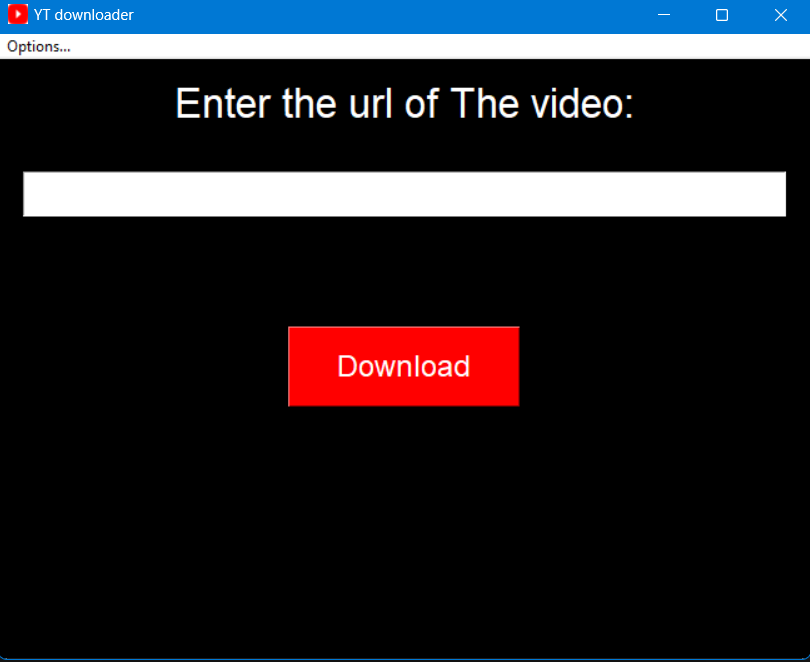
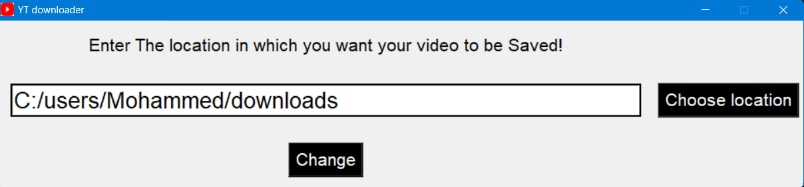

# YouTube Downloader (YTD)

This is a simple YouTube Downloader app built using **Kivy** and **KivyMD** for the graphical user interface, and **pytube** for downloading YouTube videos and audio. The app allows users to easily download YouTube videos by entering or pasting the video URL.

## Features

- **Download Video**: Download full videos from YouTube.
- **Download Audio**: Download only the audio from YouTube videos.
- **Paste URL**: Paste the video URL directly from the clipboard.
- **Clear URL**: Clear the entered URL from the text field.
- **Progress Bar**: Shows a progress bar during the download process.
- **Download Notifications**: Notify users when the download is complete.
- **Error Handling**: Displays error messages for invalid URLs or missing URLs.

## Installation

1. **Clone this repository** or download the code.
2. Install the required dependencies:
   ```bash
   pip install kivy kivymd pytube
   ```

3. Run the app:
   ```bash
   python main.py
   ```

## Usage

1. **Paste the YouTube Video URL**: Copy the URL of the YouTube video you want to download.
2. **Enter the URL**: Paste the URL into the input field, or click the clipboard button to automatically paste the URL.
3. **Choose Video or Audio**: 
   - Click the "Download" button to download the video.
   - Click the "Download audio" button to download the audio only.
4. **Download Progress**: The app will display a progress bar showing the download progress.
5. **Completion**: Once the download is finished, a notification will appear.

## App Screens

The app has the following screens:

- **Main Screen**: The primary screen where you can enter the YouTube URL and choose between video or audio downloads.
- **Tutorial**: Provides instructions on how to use the app.
- **About**: Shows the app's creators and the app name.
- **Help**: Displays troubleshooting information, such as common issues with internet connectivity.

## File Structure

```plaintext
.
├── main.py                # Python file for app logic
├── ytd.kv                 # Kivy Language file for the UI layout
├── logo.png               # App logo (used in navigation drawers)
├── teach.png              # Tutorial image
├── about.png              # About page image
├── /screenshots              # Contains all the screenshots to be displayed here in readme
```

## Screenshots




## Contributing

If you'd like to contribute to this project, please fork the repository and submit a pull request. You can improve the app by adding features like:

- Multi-language support.
- Video quality selection.
- Improved error handling.
- Dark/light mode support.

## Contact
Author: [Mohammed Abdullah Amaan](mailto:abdullah@abdullahamaan.com)
